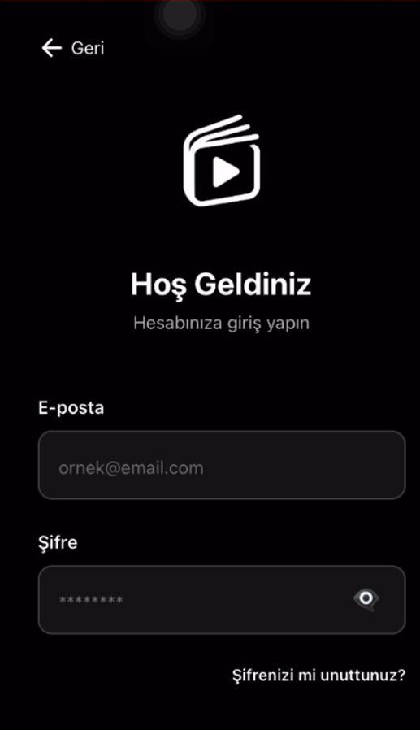
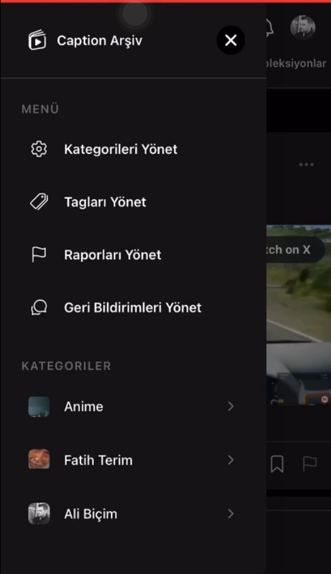
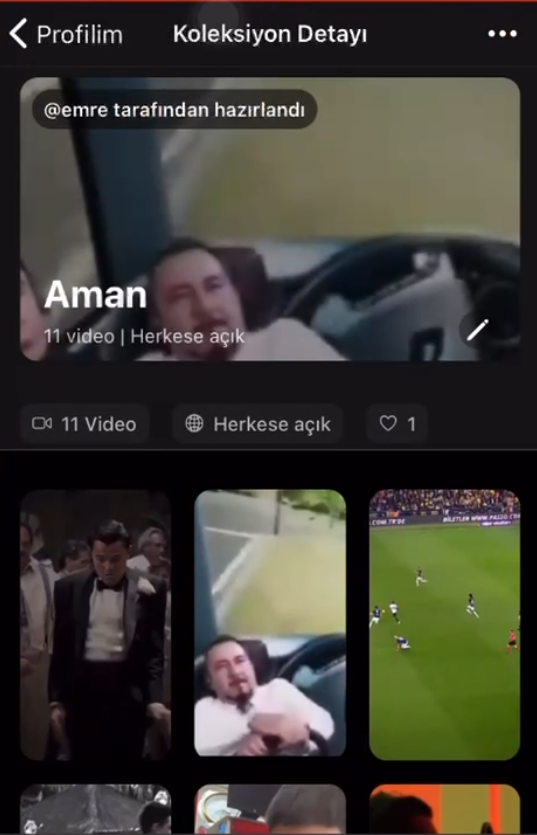
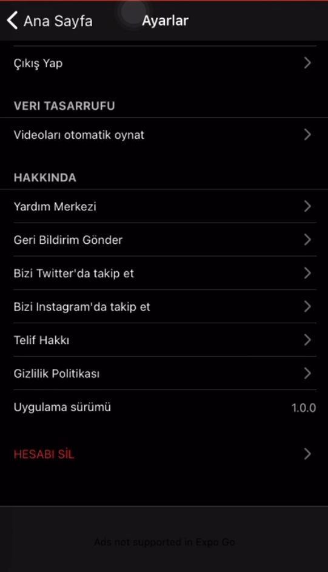

# Social Media Platform – Backend & Mobile Application

A full-stack social media platform consisting of a **.NET-based backend** and a **cross-platform mobile application** built with **React Native**.  
The project focuses on clean architecture, scalability, and real-world production features.

---

## 📌 Project Overview

This project provides the backend infrastructure and mobile client for a social media application where users can share content, follow tags, receive notifications, and access premium features.

The backend is designed as a **modular monolith** using Clean Architecture principles, while the mobile application targets both **iOS and Android** using a single codebase.

---

## 🧠 Backend Architecture

### Key Concepts

- Clean Architecture with clear separation of concerns  
- CQRS (Command Query Responsibility Segregation)  
- Modular monolith architecture (not microservices)

### Layers

- **Domain**: Core business entities and rules  
- **Application**: Use cases, CQRS handlers, and business services  
- **Infrastructure**: Database access and external service integrations  
- **Presentation**: RESTful API controllers and middleware  

### Technologies

- **C# / .NET 9**
- **Entity Framework Core**
- **SQL Database** (users, tags, categories)
- **MongoDB** (posts, notifications)
- **JWT Authentication**
- **Role-Based Authorization**
- **SignalR / Firebase** for real-time communication
- **Swagger** for API documentation
- **Redis / MemoryCache** for caching

### Core Features

- User authentication and authorization  
- Personalized home feed with featured tags  
- Tag management and moderation  
- Real-time and persistent notifications  
- Premium feature support  
- Pagination and performance optimizations  

---

## 📱 Mobile Application

### Architecture

- React Native + Expo  
- TypeScript for type safety  
- Feature-based modular folder structure  
- Centralized API client architecture  

### Technologies

- **React Native**
- **Expo**
- **TypeScript**
- **React Query** (server-state management and caching)
- **Axios** for HTTP communication
- **Firebase** (authentication & push notifications)
- **Zustand** for global state management

### Mobile Features

- Google & Apple authentication.
- Push notification support  
- Light / Dark theme switching  
- Reusable and scalable UI components  
- Single codebase for iOS and Android  

---

## 🔐 Security

- JWT-based authentication  
- Role-based authorization (admin, moderator, user)  
- Request validation using FluentValidation  
- Secure API communication for mobile clients  

---

## 🚀 Development & Testing

- Unit tests with **xUnit** and **Moq**  
- Integration tests for API and database layers  
- CI/CD ready using **GitHub Actions** or **Azure DevOps**  

---

## 🔗 Backend ↔ Mobile Communication

- Mobile application communicates with the backend via RESTful APIs  
- Backend handles all business logic and data processing  
- Featured tags and feed logic are fully backend-driven  

---

## 📄 API Examples

- GET  /api/homefeed
- POST /api/tags/update
- GET  /api/notifications

## 📈 Project Goals

- Maintainable and testable architecture
- Scalable backend and mobile application
- Production-ready authentication and notification systems
- Clean, readable, and extensible codebase

---

## 🧩 Future Improvements

- Advanced feed ranking algorithms
- Offline-first mobile experience
- Admin dashboard
- Enhanced analytics and monitoring

## 📸 Screenshots

## 🧑‍💻 Author

**Emre Baş**  
Backend & Mobile Software Engineer

